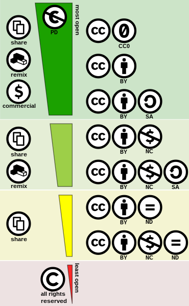

# Common Licenses

## PD

Public Domain

1. resources:
    1. [Wikipedia](https://en.wikipedia.org/wiki/Public_domain);
    2. [Creative Commons](https://creativecommons.org/share-your-work/public-domain/pdm/);
2. unrestricted use;

## Creative Commons

Author: Shaddim; original CC license symbols by Creative Commons. Extracted from [here](https://creativecommons.org/share-your-work/public-domain/freeworks).

### Resources

1. [Creative Commons - Website](https://creativecommons.org/);
2. [Creative Commons - Licenses](https://creativecommons.org/about/cclicenses/);
3. [Creative Commons - Choose a License](https://creativecommons.org/choose/);
